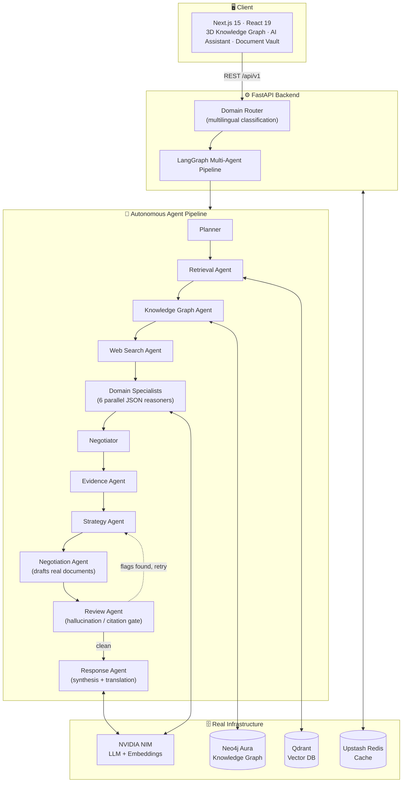
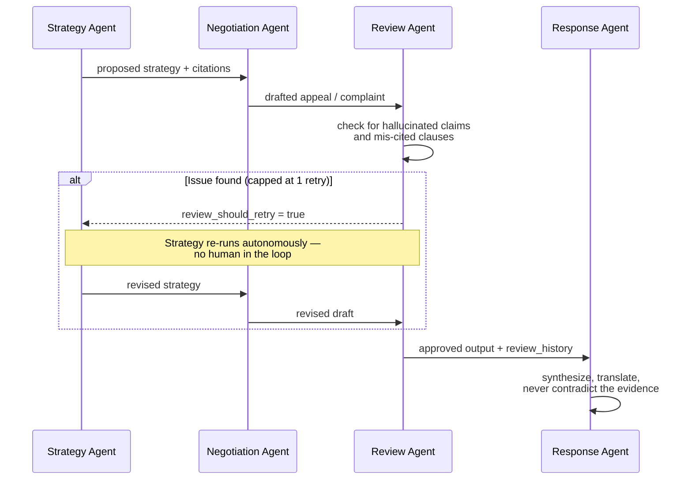

<div align="center">

# ⚖️ PROXY

### Agentic Autonomous AI for Consumer Justice

**Five autonomous agents that research, gather evidence, strategize, negotiate, review, and self-correct their own work — across 8 real-world dispute domains — without a human steering each step.**

[](https://github.com/rakeshselvaraj0108/Proxy/actions/workflows/backend-ci.yml)
[](https://github.com/rakeshselvaraj0108/Proxy/actions/workflows/frontend-ci.yml)


**[▶️ Demo Video](https://youtu.be/M_n-Z1yxMUg) &nbsp;·&nbsp; [🚀 Live App](https://proxy-frontend-7am8.onrender.com) &nbsp;·&nbsp; [🩺 API Health](https://proxy-backend-0sct.onrender.com/health) &nbsp;·&nbsp; [📦 Source](https://github.com/rakeshselvaraj0108/Proxy)**

</div>

---

## Table of Contents

- [Demo Video](#demo-video)
- [The Problem](#the-problem)
- [What PROXY Actually Does](#what-proxy-actually-does)
- [What Makes This Agentic, Not a Chatbot](#what-makes-this-agentic-not-a-chatbot)
- [Architecture](#architecture)
- [The Self-Correction Loop](#the-self-correction-loop)
- [8 Domains, One Router](#8-domains-one-router)
- [Novel, Verifiable Features](#novel-verifiable-features)
- [Tech Stack](#tech-stack)
- [Live Deployment](#live-deployment)
- [Running It Locally](#running-it-locally)
- [Project Structure](#project-structure)

---

## Demo Video

[](https://youtu.be/M_n-Z1yxMUg)

**[▶️ Watch on YouTube](https://youtu.be/M_n-Z1yxMUg)**

## The Problem

Every year, millions of people get a claim denied, a flight cancelled, a deposit withheld, or a bill they never agreed to — and have no real way to know whether the rejection was even lawful. They ask a general-purpose chatbot, get a plausible-sounding paragraph with no citations and no memory of anyone else's case, and give up. Meanwhile the institution on the other end has denied the *same* claim, the same way, hundreds of times — and no single user, and no single chat session, can ever see that pattern.

## What PROXY Actually Does

You describe your dispute in one sentence, in **any language**, optionally attach evidence (a policy document, a bank statement, a lab report). PROXY:

1. **Classifies** which of 8 domains it belongs to — often more than one at once (a cancelled flight *and* a rejected travel-insurance claim run in parallel, independently, and get merged into one report).
2. **Researches** the applicable regulation from a real, pre-indexed vector database — not the model's training-data memory.
3. **Extracts evidence** from your uploaded document (OCR'd if it's a scan), and flags outright if the document doesn't actually relate to your case.
4. **Builds a strategy and drafts real documents** — a formal appeal letter, a complaint email, an escalation note, a regulator complaint — ready to send.
5. **Reviews its own output** for hallucinated claims or mis-cited clauses, and if it finds one, **autonomously retries** the strategy step before you ever see the answer.
6. **Replies in whatever language you asked in** — Tamil, Hindi, Japanese, Chinese, Portuguese, or English — start to finish, no partial translation.

## What Makes This Agentic, Not a Chatbot

| A chatbot | PROXY |
|---|---|
| One model call, one shot | 5+ specialist agents in a real LangGraph state machine |
| No memory beyond this conversation | A knowledge graph of every citizen's case, aggregated |
| Trusts its own first draft | A Review agent that gates the output and forces a retry on hallucination |
| Generic "relevant regulations" | Citations run through a deterministic verification pass, unverified ones flagged inline |
| Can't tell you if this happens to other people | Institution Accountability Radar: real cross-citizen dispute volume, per institution, per domain |

## Architecture



## The Self-Correction Loop

The one behavior that separates this from a single LLM call: the Review agent can send the case **backward** through the graph.



Every pass — not just the final one — is recorded in `review_history`, so the reasoning trail shows exactly what was flagged and how it was fixed.

## 8 Domains, One Router

| Domain | Regulator / Counterparty |
|---|---|
| 🏥 Health Insurance | IRDAI |
| 🏦 Banking | RBI |
| 📡 Telecom | TRAI |
| ✈️ Airlines | DGCA |
| 🛒 E-commerce | Consumer Protection (E-Commerce) Rules |
| 🏛️ Government | RTI Act / State Right to Services |
| 🏠 Housing | RERA / Model Tenancy Act |
| 🩺 Healthcare | Clinical / patient-rights guidance |

A single query can hit multiple domains at once (`"my flight was cancelled and my travel insurance rejected the claim"` → Airlines **and** Health Insurance, run concurrently, merged into one report).

## Novel, Verifiable Features

- **🕸️ 3D Knowledge Graph** — three real, data-driven modes, not decoration:
  - **Reasoning Trail** — replay the exact sequence of agent steps that produced your case's answer.
  - **Institution Intelligence** — a comparative constellation of real patterns and similar cases for any two institutions, side by side.
  - **Knowledge Footprint** — your personal orrery: every domain and case you've ever filed, orbiting you.
- **📡 Institution Accountability Radar** — real dispute volume aggregated across *every* citizen and *every* domain in the graph. A single chatbot conversation can never show you this; it has no memory of anyone else's case.
- **🌐 True multilingual replies** — detects the language you typed in and answers entirely in it, verified live across Tamil, Hindi, Japanese, Chinese, and Portuguese.
- **✅ Citation verification engine** — every regulation cited is checked against retrieved sources; anything unconfirmed is flagged inline instead of presented as fact.
- **📁 Document Vault** — real OCR (native PDF text + vision-model fallback for scans), domain-relevance filtering, and vector indexing — not a file dump.

## Tech Stack

**Frontend** — Next.js 15 (App Router) · React 19 · TypeScript · Tailwind CSS · @react-three/fiber + drei (3D graph scenes) · TanStack Query · Zustand

**Backend** — FastAPI · LangGraph 1.0 (multi-agent orchestration) · Pydantic v2 · pypdf / pypdfium2 (OCR pipeline)

**Data layer** — Qdrant (vector search) · Neo4j Aura (knowledge graph) · Upstash Redis (cache) · NVIDIA NIM (LLM + embeddings)

**CI** — GitHub Actions, separate backend and frontend pipelines (badges above)

## Live Deployment

Deployed on Render as two independent services:

| Service | URL |
|---|---|
| Frontend (Next.js standalone) | https://proxy-frontend-7am8.onrender.com |
| Backend (FastAPI) | https://proxy-backend-0sct.onrender.com |
| Backend health check | https://proxy-backend-0sct.onrender.com/health |

> First request after a period of inactivity may take 30–60s (Render free-tier cold start) — this is a hosting characteristic, not an application bug.

### Required backend environment variables

| Variable | Purpose |
|---|---|
| `NVIDIA_API_KEY` | NIM API for chat + embeddings — required |
| `QDRANT_URL` / `QDRANT_API_KEY` | Vector store |
| `NEO4J_URI` / `NEO4J_USER` / `NEO4J_PASSWORD` | Knowledge graph |
| `REDIS_URL` | Optional — degrades to a safe no-op cache if unset |

## Running It Locally

```bash
# Backend
cd backend
pip install -r requirements.txt
uvicorn app.main:app --reload

# Frontend
cd frontend
npm install
npm run dev
```

No external services are required for local development — both `VECTOR_STORE_BACKEND` and `GRAPH_STORE_BACKEND` default to a local JSONL-backed fallback pre-seeded with real (smaller-scale) regulatory data checked into `backend/datasets/` via git-lfs. Set `VECTOR_STORE_BACKEND=qdrant` / `GRAPH_STORE_BACKEND=neo4j` plus the credentials above to run against the real managed services instead.

## Project Structure

```
Proxy/
├── backend/
│   ├── app/
│   │   ├── agents/          # LangGraph orchestration + role agents (Research, Evidence, Strategy, Negotiation, Review, Response)
│   │   ├── api/routes/       # FastAPI route handlers
│   │   ├── knowledge_graph/  # Neo4j + JSONL-fallback graph stores
│   │   ├── rag/              # Chunking, embedding, retrieval (Qdrant + JSONL fallback)
│   │   ├── services/         # Storage, OCR, document relevance, cache
│   │   └── prompts/          # Per-domain prompt templates
│   └── datasets/             # Pre-indexed regulatory data (git-lfs)
└── frontend/
    ├── app/dashboard/         # Dashboard, Assistant, Documents, Analyses, Knowledge Graph, Institution Radar
    ├── components/            # Chat, documents, dashboard UI
    └── features/knowledge-graph/  # Self-contained 3D graph feature (schemas, queries, Zustand store, scenes)
```

---

<div align="center">

**Built for a world-level hackathon. Every claim in this README is backed by code you can read in this repository.**

</div>
